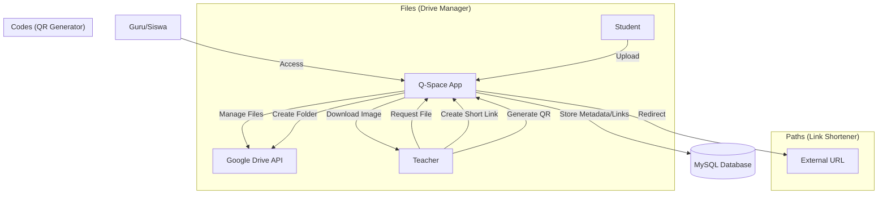

# Q-Space Project Plan

## 📚 Overview
**Q-Space** is an integrated productivity universe for education, designed to "Organize Your Learning Universe." It serves as a central hub for file management, link shortening, and QR code generation, seamlessly integrated with the Q-Link ecosystem.

- **Base URL**: `space.q-link.test` (Local) / `space.q-link.my.id` (Production)
- **Tech Stack**: Laravel 12, Filament, Livewire, Google Drive API v3.
- **Authentication**: Integrated with Q-Link (Laravel Breeze / Socialite).

---

## 🏗️ Architecture

---

## 🌟 Core Features

### 1. Files (Formerly Q-Store)
*Management of assignments and documents based on Google Drive.*
- **Teacher**: Create file requests, organize folders automatically on Drive.
- **Student**: Upload assignments directly to the specific folder.
- **Integration**: Uses `GoogleDriveService` for seamless API interaction.

### 2. Paths (Link Shortener)
*Orbits for your digital resources.*
- Custom short links (e.g., `q-space.id/math101`).
- Analytics (Click counting).
- QR Code auto-generation for every link.

### 3. Codes (QR Generator)
*Visual portals.*
- Generate QR codes for text, URLs, or Wi-Fi.
- **Customization**:
    - Colors (Space Blue, Nebula Purple, etc.)
    - Logo overlay (School logo).
    - Styles (Dots, Squares).

---

## 📦 Database Schema

### 1. File Ecosystem
*   `file_requests` (Teacher requests)
*   `file_submissions` (Student uploads)
*   `user_google_tokens` (OAuth tokens)

### 2. Paths Ecosystem (`short_links`)
*   `id`: Primary Key
*   `user_id`: FK to Users (Creator)
*   `original_url`: Text
*   `short_code`: String (Unique, e.g., "math101")
*   `visits`: Integer (Default 0)
*   `is_active`: Boolean
*   `created_at`: Timestamp

---

## � Installation & Setup Checklist

### ✅ Completed
- [x] Install Laravel 12 & Dependencies.
- [x] Setup Basic Auth & Google Drive Service.
- [x] Implement File Request logic.

### 📝 To-Do (Rebrand & Expansion)
1.  **Rebranding**:
    - [ ] Update App Name in Config (`.env`, `config/app.php`).
    - [ ] Rename UI Elements "Q-Store" -> "Q-Space".
    - [ ] Update Navigation Menu (Files, Paths, Codes).

2.  **Feature - Paths**:
    - [ ] Create `short_links` migration.
    - [ ] Implement Redirection Logic.
    - [ ] UI for managing links.

3.  **Feature - Codes**:
    - [ ] Integrate QR Library (e.g., `simplesoftwareio/simple-qrcode`).
    - [ ] Create Generator UI (Form with live preview).

---

## 💡 Notes
- **Folder Renaming**: The physical folder `d:/xampp/htdocs/q-store` will be renamed to `q-space` manually by the user after initial code updates are committed.
- **Tagline**: "Organize Your Learning Universe."
